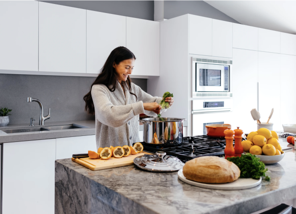

<section class="a_intro">
 

 
 

  

  <h1>Lifestyles Transformed</h1>
  
We believe that following a Plant-based diet can drastically improve your overall health, so we built a community motivating people to lead healthier lifestyles by providing guidance and access to healthy food habits.
 
  <button class="hero-button" style="margin-left:70px;">Learn More</button>
  

 </section>

   <!-- 

  

  <h1 style="text-align: left; padding-top:60px;">Lifestyles Transformed</h1>
  
We believe that following a Plant-based diet can drastically improve your overall health, so we built a community motivating people to lead healthier lifestyles by providing guidance and access to healthy food habits. 

    <button class="hero-button">Learn More</button>

          
 -->
   

    

    <h1>Our Mission</h1>
    
At Re Leaf we are committed to helping people attain the highest degree of health. Our goal is to inspire and empower people to succeed in a safe and caring environment by supporting them as they work towards their goals.

    

    

    

Teaching you how nutrients and food components impact human health.

    
  
Providing a large variety of recipes and meal prep ideas that make life easier.

    

Offering events ranging from yoga workshops to cooking classes.

     
   

      

    
  

 

    <h1 style="text-align:left; margin-bottom: 0px;">Events</h1>

Re Leaf offers monthly events that will help you improve your overall health. One of the ways Re Leaf will help you get healthier is through our events. Including cooking lessons, meditation classes, and yoga sessions, we’ll always have something planned. This month, we’ll even have a special guest that will speak at our events. 

    <button class="hero-button">Sign Up</button>

                 

                 

    <h3>Yoga Flow</h3>
        
If you are looking for a balance between your life and workload we got your back!!

                 

     <h3>Nutritional Facts</h3>
        
Are you following a vegan diet and wondering how to get enough protein? Come join us and learn from a professional.

             

    

    

    <h1>Blogs</h1>
    

    

        

            

           
        

            

            
Love & Lemons
                

                <a href="#" class="btn">View Full Project</a>
        

            
  

    

     

        
        

            

            
Minimalist Baker
                

                <a href="#" class="btn">View Full Project</a>
        

            
   
 <!-- Div card Closing -->
    

       

         
        

            

            
Lorem ispsum
                

                <a href="#" class="btn">View Full Project</a>
        

            
  
 <!-- Div card Closing -->
        
  <!-- Div row Closing -->
    
  

    

<section class="a_intro">
 

 
 

  

  <h2 style="text-align: left; padding-left:70px;">Want to join?</h2>
  
We believe that following a Plant-based diet can drastically improve your overall health, so we built a community motivating people to lead healthier lifestyles by providing guidance and access to healthy food habits.
 
  <button class="hero-button" style="margin-left:70px;">Learn More</button>
  

 </section>

 
<!-- 
   

      

    <h2 style="text-align: left; padding-left:70px;">Want to join?</h2>

Want to join our team, help organizing events, or become an active member? Learn about our values and aspirations first.  

    <button class="hero-button">Learn More</button>

          
 -->

 
