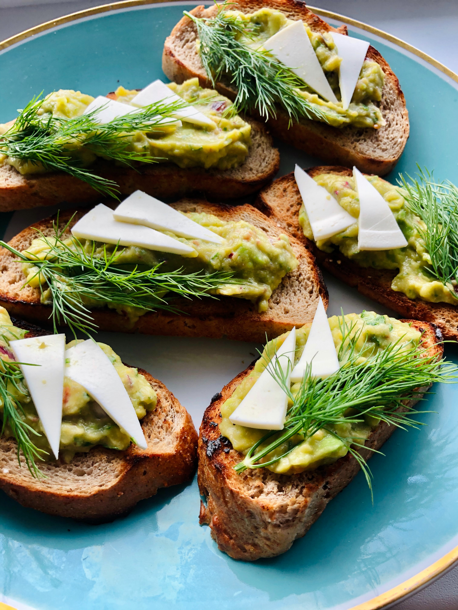

  <head>
    <meta charset="utf-8">
    <meta name="viewport" content="width=device-width, initial-scale=1.0">
    <title>Re Leaf</title>
    <link rel="stylesheet" href="recipe.css">
    <link rel="preconnect" href="https://fonts.gstatic.com">
<link href="https://fonts.googleapis.com/css2?family=Lato&display=swap" rel="stylesheet">
      
  </head>
  <body>

     
<!--Put nav here-->
 

  <ul class="recipe-description">
    <li>Monday</li>
    <li><h2>Lentil Salad with Feta and Cous Cous</h2></li>  
    <li>This recipe contains 40% of daily protein value with only 410 calories. It is very delicios and will keep you full and active through the day. </li>
    <li>Time:<strong>40 minutes</strong> </li>
    <li>Calories:<strong>410</strong></li>  
    </ul>

          

      

            <h2>Nutrition</h2>
          

            

  

    <b>Calories</b>
    
410

  
              

          
        

  

    <b>Sodium</b>
    
40% DV
  
  

 
    

  

    <b>Fat</b>
    
28% DV
 
    

 
            

  

    <b>Protein</b>
    
39% DV
 
    

 
     

  

    <b>Carbs</b>
    
14% DV

  

 
            

  

    <b>Fiber</b> 
    
76 DV
 
  

 
    

      

      <h3>List of Ingredients:</h3>
      <ul class="ing-list">
          <li>1 1/2 cup black beluga lentils(or French Lentils)</li>
          <li>ONion chopped (any type of color)</li>
          <li>1 teaspoon kosher salt</li>
          <li>Olive oil</li>
          <li>Bell Pepper</li>
          <li>1 bunch of parsley/cilantro/dill/chives</li>
          <li>Baby arugula</li>
          <li>4 radishes</li>
          <li>7 Cherry tomatoes</li>
          <li>1 Carrot</li>
          <li>Optional: Any seeds or crushed nuts for crunchy texture</li>
          <li>Optional: Breadcrumbs (I usually toast bread and crush it in pieces - looks very authentic)</li>
          <li>Optional: cook a cup of pearl couscous as an optional carb to delish lentil salad</li>
          </ul>
      

          

          <h2>Instructions</h2>
          <h3>Step 1:</h3>
          
For lentils: chop half of the onion, 1/3 bell pepper, grate or micro chop a carrot. Pour 1 table spoon of olive oil to the medium sausepan. Put on the medium heat and add the chopped veggies with a pinch of salt. Fry the veggies for 5-7 minutes and add the 3 cups of water. Stir the saucepan contents and put 1.5 cup of lentils inside. 
      
          
<h3>Step 2:</h3>
          
Salad: Place the lentils in the large bowl with the dressing. Add the onions, pepper, herbs, baby arugula, feta cheese, and nuts. Add the 1/2 teaspoon kosher salt and fresh ground pepper and mix to combine. 

           
    <h3>Step 3:</h3>
        
Lorem ipsum dolor sit amet, consectetur adipiscing elit. Praesent vel bibendum urna, a lacinia erat. Suspendisse sed augue a libero scelerisque venenatis sit amet sed neque. Aliquam tristique laoreet semper. Aliquam sodales, enim a ullamcorper rutrum, massa arcu aliquet purus, quis vehicula arcu mi sit amet nunc. Cras porta suscipit quam eget blandit. Donec tincidunt lorem eu mi efficitur, rhoncus maximus felis tempor. 

    <h3>Step 4:</h3>
          
Place the lentils in the large bowl with the dressing. Add the onions, pepper, herbs, baby arugula, feta cheese, and nuts. Add the 1/2 teaspoon kosher salt and fresh ground pepper and mix to combine. 

          

      
<section class="back-to">
          <h2>Want to explore more Recipes? Continue browsing</h2>
         <a href="#"> 

              
Back to 
 
             <h1>Meal Preps</h1>
                  
</a>
      </section>
          

          <!-- Put footer here -->
  </body>